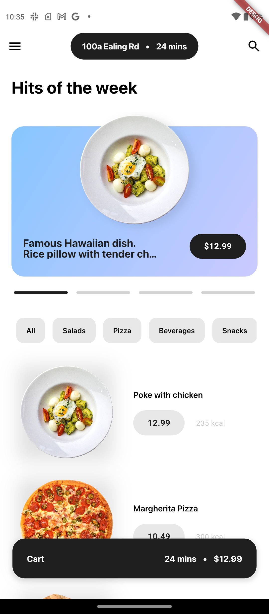
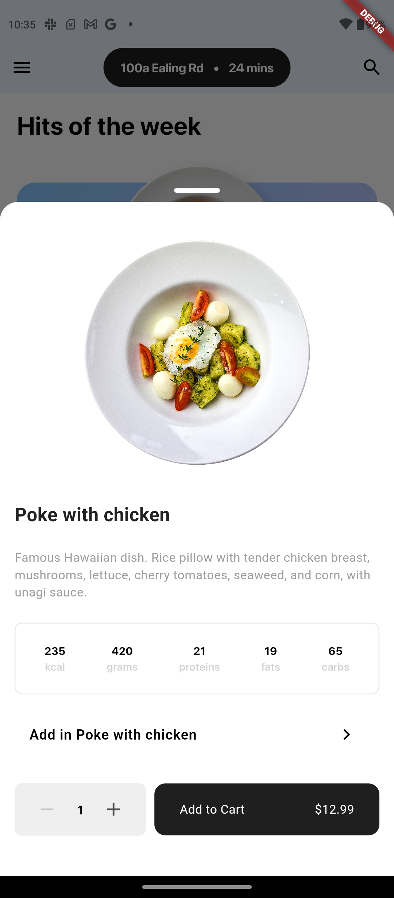
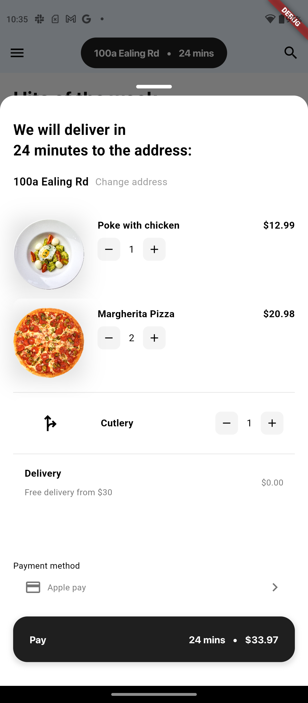

# Single Restaurant Food Delivery App

This repository contains the source code for a **Single Restaurant Food Delivery App**. The app allows users to explore a restaurant’s menu, add items to their cart, and proceed to checkout. It features a modern, responsive design and supports light and dark themes, with components built using a reusable design system.

---

## 📸 App Screenshots

### Home Screen



### Item Details



### Checkout



## Direct Install

- Download this app from this google drive folder and directly run it in your android device. It does not have any external requirements like internet but it does simulate a network call.
📥 [Download APK](https://drive.google.com/file/d/1hk3fZRjqVNFcIGwdv_nKfhLHRuS7yelF/view?usp=sharing)

## 🚀 Features

### Core Features:

- **Menu Management**: Display a carousel of food items with details like name, price, and image.
- **Cart Functionality**: Add, remove, and update quantities of items in the cart.
- **Responsive Design**: Adapts seamlessly to various screen sizes.
- **Theme Support**: Switch between light and dark themes.
- **Checkout Experience**: Floating cart bar and bottom-sheet checkout.

### UI Highlights:

- **Gradient Container with Overflowing Image**: Showcasing menu items with a visually appealing layout.
- **Carousel Slider with Indicators**: Swipe through menu items with a dot indicator for navigation.
- **Customizable Components**: Designed using a modular design system for easy customization.

---

## 🛠️ Tech Stack

### Frameworks and Tools:

- **Flutter**: Mobile development framework.
- **Bloc**: State management for predictable and testable state transitions.
- **Responsive Design**: Ensures compatibility across various devices using utilities like `ResponsiveDimensions`.

### Design System:

- **Colors**: Managed using `AppColors`.
- **Typography**: Managed using `AppTypography`.
- **Widgets**: Custom components like `RoundedEdgeButton`, `ResponsiveSizedBox`, and `GradientContainerWithOverflowingImage`.

---

Here's the updated **Folder Structure** section for your Markdown file:

---

### 📂 Folder Structure

```plaintext
├── lib
│   ├── appbar
│   │   └── appbar.widget.dart
│   ├── design_system
│   │   ├── colors.dart
│   │   ├── responsiveness
│   │   │   ├── responsive_demensions.dart
│   │   │   ├── responsive_fonts.dart
│   │   │   └── responsive_padding.dart
│   │   ├── theme.dart
│   │   ├── typography.dart
│   │   └── widgets
│   │       ├── responsive_sized_box.widget.dart
│   │       └── rounded_edge_button.widget.dart
│   ├── home
│   │   ├── core
│   │   │   └── types
│   │   │       ├── failure.type.dart
│   │   │       └── menu_item.type.dart
│   │   ├── data
│   │   │   ├── dtos
│   │   │   │   └── menu_item.dto.dart
│   │   │   └── repositories
│   │   │       └── menu.repo.dart
│   │   └── presentation
│   │       ├── cubit
│   │       │   ├── menu_cubit.dart
│   │       │   └── menu_state.dart
│   │       ├── pages
│   │       ├── routes
│   │       └── widgets
│   │           └── gradient_container_with_overflow_image.widget.dart
│   ├── images.dart
│   ├── main.dart
│   └── mocks
│       └── mockData.dart
├── pubspec.lock
├── pubspec.yaml
├── purr.iml
```

---

### 📘 Explanation of Key Folders

1. **`appbar/`**  
   Contains reusable app bar widgets for consistent navigation UI.

2. **`design_system/`**  
   Centralized design tokens like colors, typography, responsive utilities, and reusable widgets:

   - **`colors.dart`**: Defines color palette for the app.
   - **`responsive_padding.dart`** & **`responsive_demensions.dart`**: Ensures UI responsiveness.
   - **`widgets/`**: Reusable widgets like buttons and size boxes.

3. **`home/`**  
   Houses all features related to the home page:

   - **`core/`**: Types and models used across the module.
   - **`data/`**: DTOs and repositories for data fetching or storage.
   - **`presentation/`**: Handles UI layer including state management, widgets, and pages.

4. **`mocks/`**  
   Contains mock data for development or testing.

---

## 🎨 Design System Overview

### Colors:

- **Primary Colors**: Azure Breeze, Lavender Mist
- **Text Colors**: Charcoal Black

### Typography:

- **Font**: SF Pro Display
- **Styles**:
  - `bodyTextBold2`: Used for titles.
  - `labelText`: Used for button labels.

### Responsive Utilities:

- **ResponsiveDimensions**: Proportional height/width calculations.
- **ResponsiveEdgeInsets**: Adaptive padding and margins.

---

## 💡 Setup Instructions

### Prerequisites:

- Flutter SDK installed
- IDE: [Android Studio](https://developer.android.com/studio) or [VS Code](https://code.visualstudio.com/)

### Steps:

1. Clone the repository:
   ```bash
   git clone https://github.com/your-repo/single-restaurant-delivery.git
   cd single-restaurant-delivery
   ```
2. Install dependencies:
   ```bash
   flutter pub get
   ```
3. Run the app:
   ```bash
   flutter run
   ```

---

## 🧪 Testing

The app includes unit and widget tests for core functionalities:

- **Menu State Management**
- **Cart Logic**
- **UI Widgets**

Run the tests with:

```bash
flutter test
```

---

## 📜 Future Enhancements

- Add **Order Tracking** functionality.
- Implement a **Payment Gateway** for seamless transactions.
- Optimize performance for large menus.

---

## 🤝 Contributing

Contributions are welcome! Follow these steps:

1. Fork the repository.
2. Create a feature branch:
   ```bash
   git checkout -b feature/your-feature
   ```
3. Commit changes and push:
   ```bash
   git commit -m "Add your message"
   git push origin feature/your-feature
   ```
4. Create a pull request.

---

## 📄 License

This project is licensed under the [MIT License](LICENSE).

---

### ❤️ Acknowledgments

Special thanks to the contributors and the Flutter community for their resources and support!
